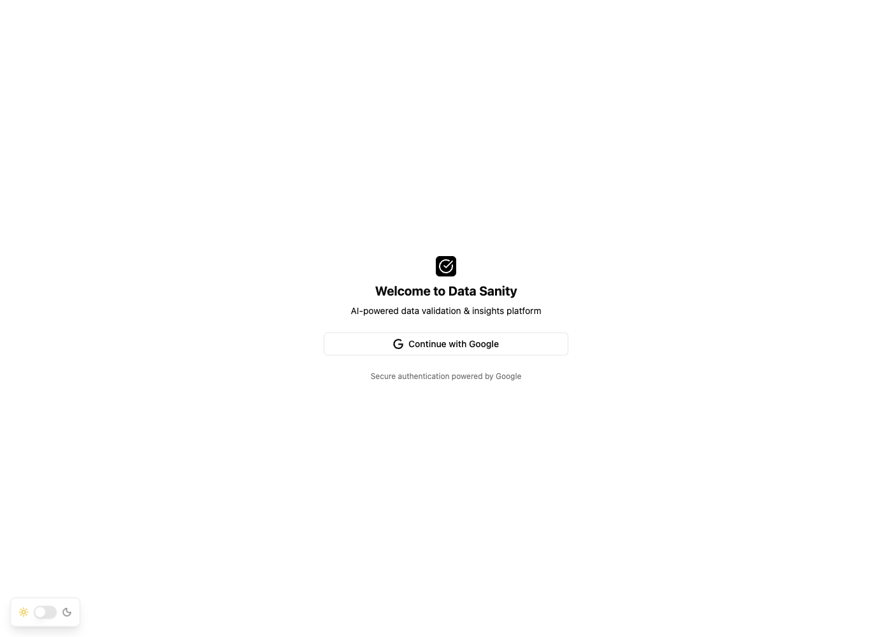

# Data Sanity 🔍

> A comprehensive data quality assessment platform that helps you analyze, validate, and get AI-powered insights on your datasets.


## ✨ Features

- 🔐 **Secure Authentication** - Google OAuth integration for secure user access
- 📊 **Multi-format Data Support** - Upload CSV files or connect Google Sheets directly
- 🤖 **AI-Powered Analysis** - Get intelligent insights and recommendations using Google Gemini AI
- 📈 **Interactive Reports** - Comprehensive data quality reports with visualizations
- 🎨 **Modern UI** - Clean, responsive design with light/dark theme support
- ⚡ **Real-time Processing** - Live feedback during data analysis

## 🖼️ Screenshots

### Login Screen


### Reports History


### Detailed Reports


## 🚀 Built With

- **Framework:** [Next.js 15](https://nextjs.org/) with React 19
- **Authentication:** [Supabase Auth](https://supabase.com/auth) with Google OAuth
- **Database:** [Supabase](https://supabase.com/)
- **AI Integration:** [Google Gemini AI](https://ai.google.dev/)
- **UI Components:** [shadcn/ui](https://ui.shadcn.com/) + [Radix UI](https://radix-ui.com/)
- **Styling:** [Tailwind CSS](https://tailwindcss.com/)
- **Icons:** [Lucide React](https://lucide.dev/)
- **Build Tool:** Turbopack
- **Screenshot Automation:** [Playwright](https://playwright.dev/)

## 🛠️ Development

### Prerequisites

- Node.js 18+
- npm or yarn
- Supabase project setup
- Google Cloud Console project with Sheets API enabled

### Getting Started

1. **Clone the repository**
   ```bash
   gh repo clone lindsay-kk/vibe-coding-data-sanity
   cd vibe-coding-data-sanity
   ```

2. **Install dependencies**
   ```bash
   npm install
   ```

3. **Environment Setup**

   Create a `.env.local` file in the root directory:
   ```env
   # Supabase Configuration
   NEXT_PUBLIC_SUPABASE_URL=your_supabase_url
   NEXT_PUBLIC_SUPABASE_ANON_KEY=your_supabase_anon_key

   # Google Configuration
   GOOGLE_CLIENT_ID=your_google_client_id
   GOOGLE_CLIENT_SECRET=your_google_client_secret
   GOOGLE_SHEETS_API_KEY=your_google_sheets_api_key
   GOOGLE_GEMINI_API_KEY=your_gemini_api_key

   # NextAuth Configuration
   NEXTAUTH_URL=http://localhost:3000
   NEXTAUTH_SECRET=your_nextauth_secret
   ```

4. **Start development server**
   ```bash
   npm run dev
   ```

   Open [http://localhost:3000](http://localhost:3000) to view the application.

### Available Scripts

| Script | Description |
|--------|-------------|
| `npm run dev` | Starts development server with Turbopack |
| `npm run build` | Creates production build |
| `npm run start` | Starts production server |
| `npm run lint` | Runs ESLint for code quality |

## 🔧 Configuration

### Supabase Setup

1. Create a new Supabase project
2. Enable Google OAuth in Authentication settings
3. Add your domain to allowed redirect URLs
4. Copy your project URL and anon key to `.env.local`

### Google Cloud Setup

1. Create a project in Google Cloud Console
2. Enable Google Sheets API and Google Drive API
3. Create OAuth 2.0 credentials
4. Generate an API key for Gemini AI
5. Add credentials to `.env.local`

## 📝 How It Works

1. **Upload Data**: Users can upload CSV files or connect Google Sheets
2. **AI Analysis**: Google Gemini AI analyzes data quality, structure, and content
3. **Generate Insights**: Platform provides recommendations and identifies potential issues
4. **Interactive Reports**: Users can explore detailed reports with charts and statistics
5. **Export Options**: Download analysis results and recommendations

## 🤝 Contributing

Contributions are welcome! Please feel free to submit a Pull Request.

## 👨‍💻 Author

**Linh Kieu** - Created for Vibe Coding class demo

---

<div align="center">
  <p>Made with ❤️ using Next.js 15 and modern web technologies</p>
</div>